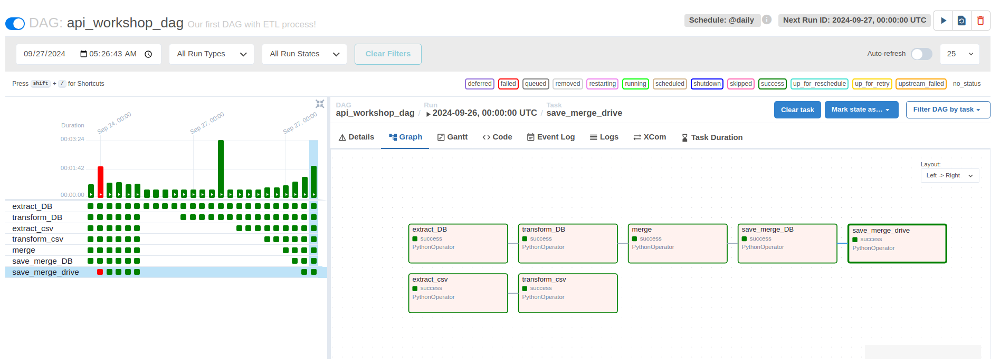
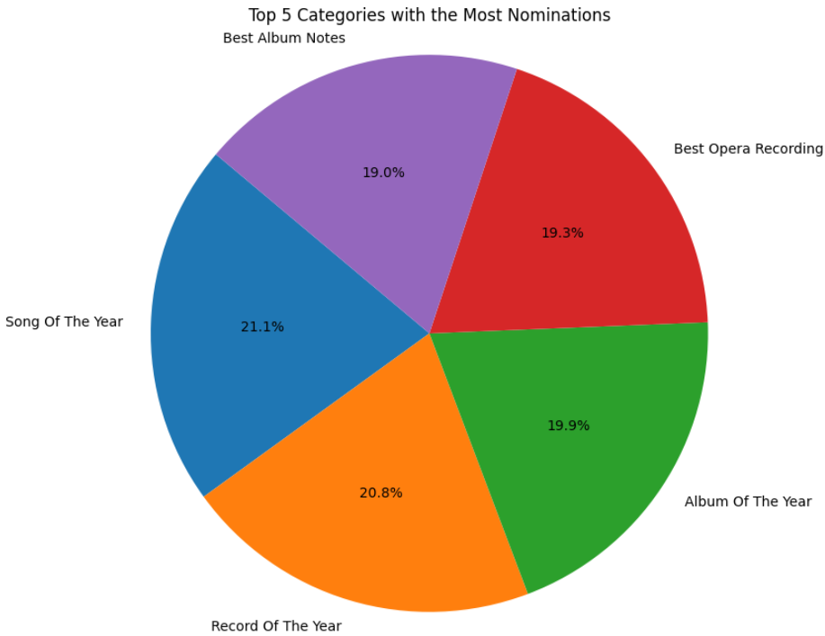

# README

## Context

Ester workshop seeks to analyze 2 datasets, one with the Grammys delivered and another one full of songs from spotify, the EDA process will be performed where the information will be extracted from databases and CSV to go through the process of transforming the values and finally the upload of the same data. Subsequently, visualizations of the data will be made to show the information in a more visual way and understand what they are trying to tell us.

## Technologies used

**Jupyter:** manipulation and transformation of all data.

**Airflow:** Data flows for the ETL of the project.

**Power BI:** Data visualizations.

**Drive:** Platform to save a copy of the information.

**PosgresSQL:** Database to store the data.


## Installation

For the execution of the project it is required to download the repository and execute the command:

```bash
poetry install
```

Then activate the virtual environment with:

```bash
poetry shell
```

Finally proceed with the installation and start Airflow:

```python
export AIRFLOW_HOME=$(pwd)/airflow
```

```python
export AIRFLOW__CORE__LOAD_EXAMPLES=false
```

```python
AIRFLOW_VERSION=2.10.1
PYTHON_VERSION="$(python -c 'import sys; print(f"{sys.version_info.major}.{sys.version_info.minor}")')"
CONSTRAINT_URL="https://raw.githubusercontent.com/apache/airflow/constraints-${AIRFLOW_VERSION}/constraints-${PYTHON_VERSION}.txt"
pip install "apache-airflow==${AIRFLOW_VERSION}" --constraint "${CONSTRAINT_URL}"
```

```python
pip uninstall sqlalchemy 
```

```python
pip install apache-airflow
```

```python
pip install pandas==2.1.4
```

After we go to airflow directory an in airflow.cfg we change the path to:

```python
dags_folder = /this_is/your/path/WorkShop-2/dags
```

to charge our Dags.

```python
airflow standalone
```

Then enter the browser and paste the link:

```bash
localhost:8080
```

## Airflow



[Watch the video on Google Drive](https://drive.google.com/file/d/1EWWstVq72A_GlmfGSReMHbA_jTC17-HH/view?usp=sharing)

---

## visualizations




## Dashboard


